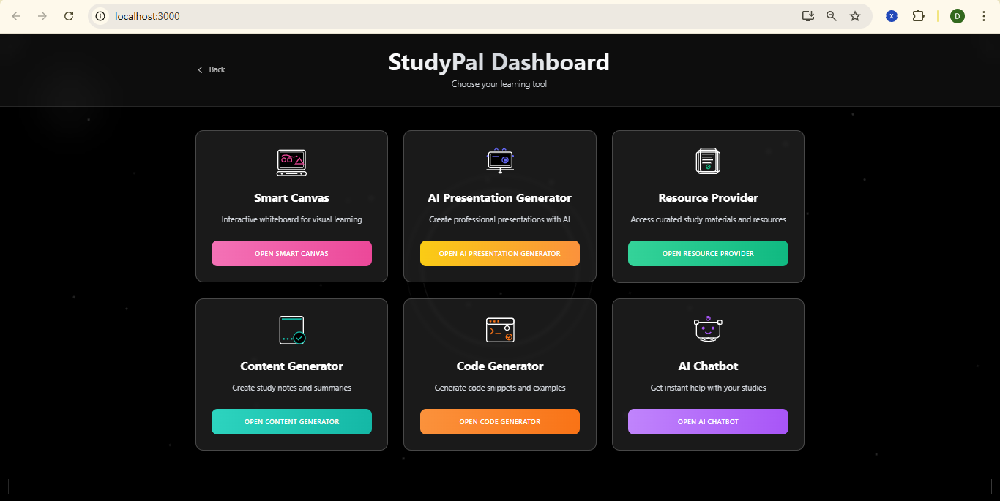
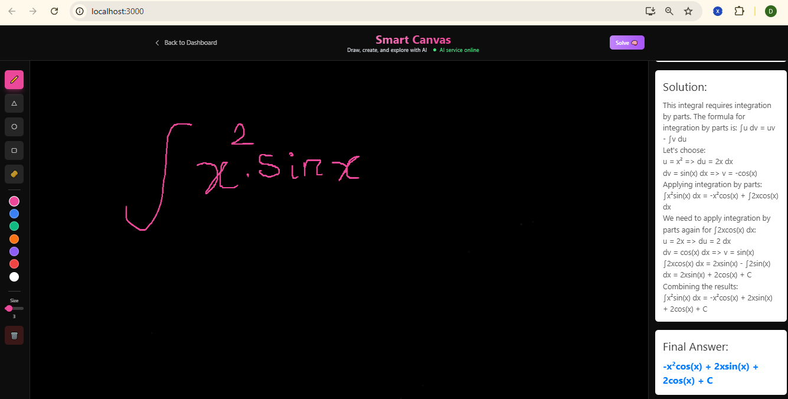
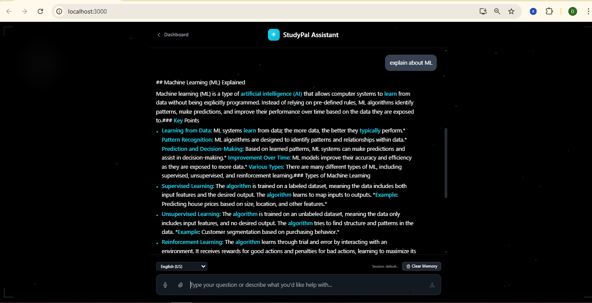
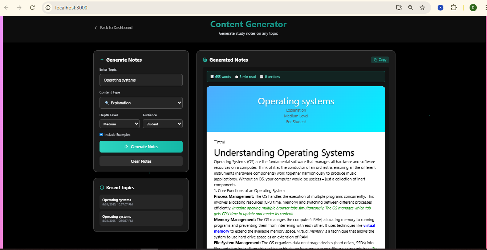
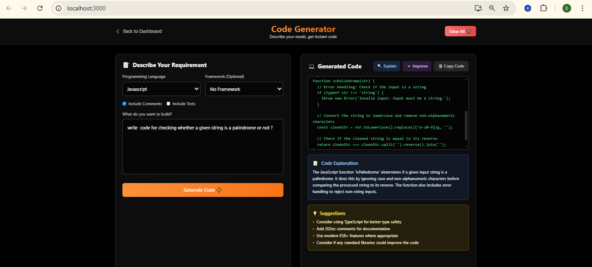
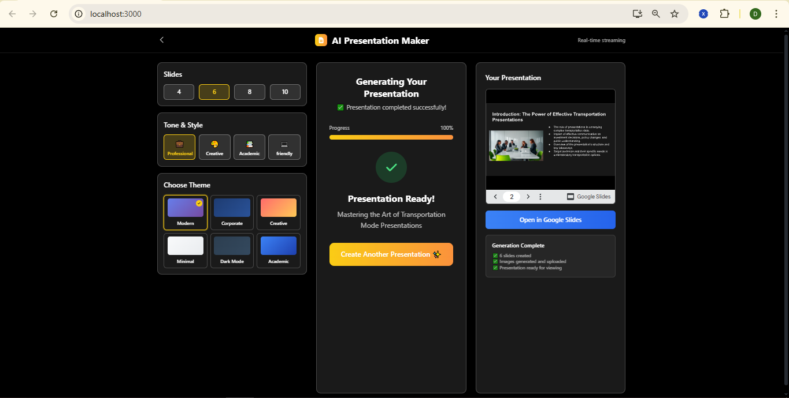
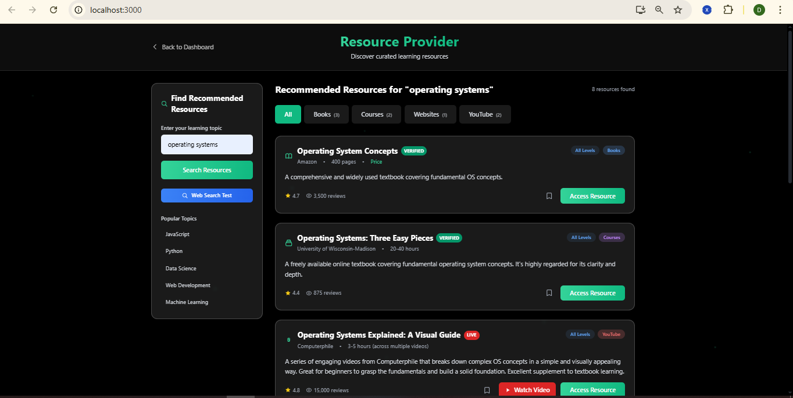

# StudyPal 🎓

> *AI-Powered Educational Platform for Enhanced Learning and Academic Success*

StudyPal is a comprehensive AI-driven educational platform that revolutionizes the learning experience through intelligent content generation, visual problem-solving, and interactive study tools. Built with cutting-edge AI technology, StudyPal empowers students, educators, and professionals to unlock their full learning potential.

---

## ✨ Features with Screenshots

### 🏠 Dashboard


### 🎨 Smart Canvas
- Draw equations, diagrams, or concepts and get instant AI-generated solutions  
- Step-by-step explanations with interactive learning  


### 🤖 AI Chatbot
- Real-time academic conversations with context retention  
- Streaming, natural typing-effect responses  


### 📝 Content Generator
- Create study notes, summaries, explanations, and guides  
- Multiple difficulty levels and target audiences  


### 💻 Code Generator
- Generate, optimize, and explain code across multiple languages  


### 📊 AI Presentation Maker
- Automatically generate professional presentations  
- Export directly to Google Slides  


### 🔍 Resource Provider
- AI-powered intelligent resource discovery  
- Curated, high-quality learning materials  


---


---

## 🚀 Quick Start

### Prerequisites
- **Node.js** (v14 or higher)
- **Python** (v3.8 or higher)
- **Google Gemini API Key** ([Get one here](https://aistudio.google.com/app/apikey))

### Installation

```bash
# Clone repository
git clone https://github.com/your-username/studypal.git
cd studypal


cd backend
python -m venv venv
# Windows
venv\Scripts\activate
# macOS/Linux
source venv/bin/activate
pip install -r requirements.txt


## Frontend
cd frontend
npm install

Visit 👉 http://localhost:3000

##Running the Application

# Start backend services
python run_chat.py
python run_code_generator.py
python run_content_generator.py
python run_pptmaker.py
python run_resource_provider.py
python smart_canvas.py

# Start frontend
cd frontend
npm start


📚 API Documentation

Each service has FastAPI Swagger docs:

Chat API → http://localhost:8012/docs

Code Generator → http://localhost:8001/docs

Content Generator → http://localhost:8009/docs

PPT Maker → http://localhost:8003/docs

Resource Provider → http://localhost:8004/docs

Smart Canvas → http://localhost:8000/docs


🛠️ Built With

Frontend: React, Tailwind CSS, Three.js

Backend: Python, FastAPI, Uvicorn

AI/ML: Google Gemini, Groq, Hugging Face

📱 Usage Examples

Smart Canvas → Draw math/science problems → Get instant AI solutions

Chatbot → Ask academic queries → Get detailed answers

Content Generator → Select topic → Generate notes/summaries

Code Generator → Input problem → Get working code + explanation

PPT Maker → Enter topic → Generate professional slides
